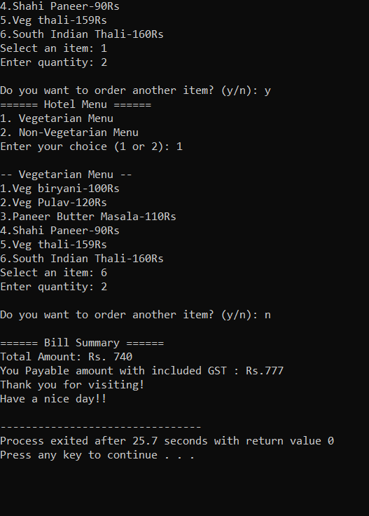

# Hotel-Bill-Management
# 🏨 Hotel Management System (C++)

This is a simple **console-based Hotel Management System** written in **C++**. It allows users to order food items from **vegetarian** and **non-vegetarian** menus, calculate total cost based on quantity, and include GST for the final payable amount.

---

## 🚀 Features

- 🍛 Two food categories: Vegetarian and Non-Vegetarian
- 🧾 Real-time billing based on selected items and quantity
- 💰 Dynamic GST calculation:
  - 5% GST for bills ≤ ₹1000
  - 10% GST for bills between ₹1001 and ₹3500
  - 15% GST for bills > ₹3500
- 🔁 Option to order multiple items in a session
- 🎉 User-friendly terminal interface

---

